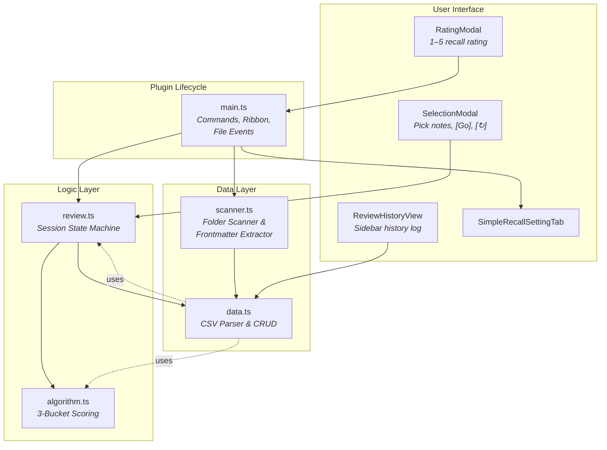
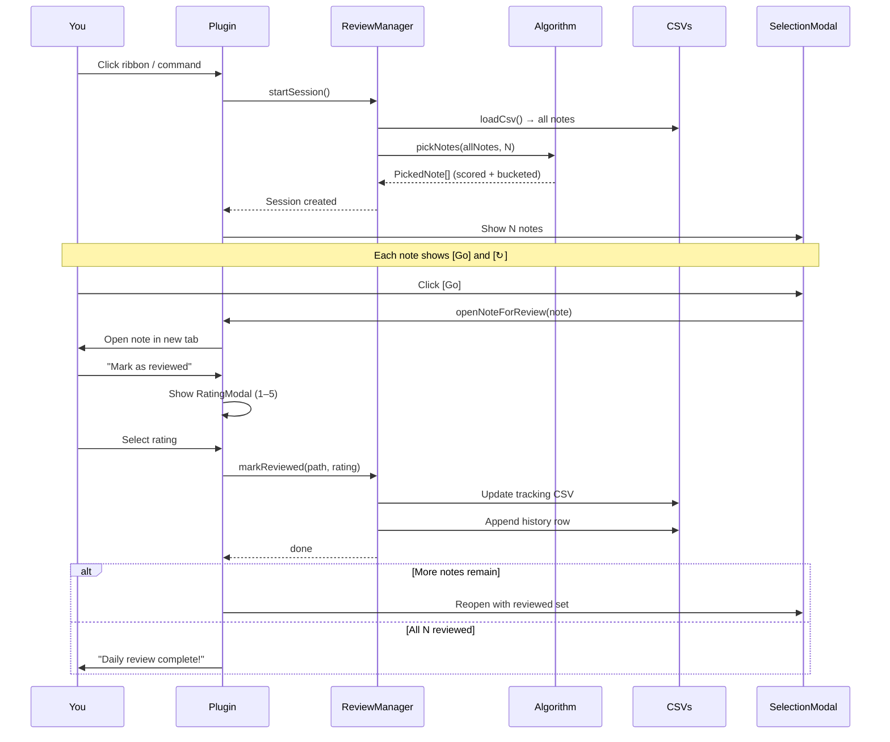
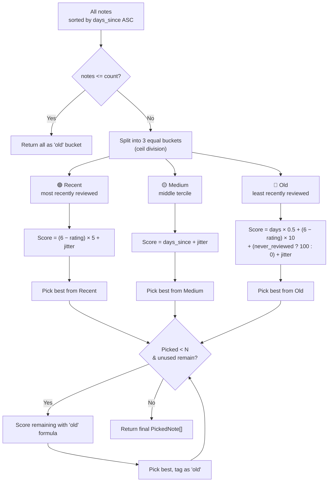
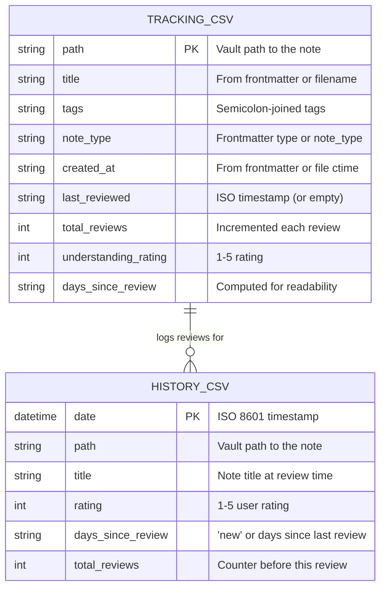

# Simple Recall

<p align="center">
  
  
  
</p>

> **Lightweight active recall for Obsidian** — no decks, no cards, no separate UI. Pick a folder of notes and review them on your own terms.

---

## 📋 Table of Contents

- [How it works](#-how-it-works)
- [Features](#-features)
- [Quick start](#-quick-start)
- [Review flow](#-review-flow)
- [Algorithm](#-algorithm)
- [Data model](#-data-model)
- [Commands](#-commands)
- [Settings](#-settings)
- [Frontmatter](#-frontmatter)
- [Development](#-development)
- [License](#-license)

---

## 🔧 How it works

The plugin is built around four cooperating layers:



- **Data layer** reads/writes two CSV files in your vault — no external databases, no cloud.
- **Logic layer** runs the 3-bucket stratification algorithm and manages review sessions.
- **UI layer** presents modals and views through Obsidian's standard APIs.
- **Plugin lifecycle** wires everything together: commands, ribbon icon, status bar, and vault file event listeners.

---

## ⚡ Features

| Icon | Feature | Detail |
|------|---------|--------|
| 🔔 | **Ribbon icon** + **4 commands** | Start review, mark reviewed, rescan folders, show history — all from the palette |
| 🧠 | **Smart 3-bucket algorithm** | Strata notes by recency, scores by weakness/overdue/new-ness, ±3 random jitter |
| 🔄 | **Per-note refresh** (↻) | Swap any note for another from the same bucket without losing progress |
| 🔁 | **Refresh all** | Re-run the algorithm, keeping already-reviewed notes intact |
| 📊 | **Status bar counter** | Shows `★ 1/3 reviewed`; click to mark the current note as reviewed |
| 📜 | **Review history sidebar** | Append-only log grouped by Today / Past 7d / Past 30d / Older |
| 👁️ | **Auto-scan on startup** | Detects new, deleted, and renamed notes when Obsidian opens |
| 📁 | **File watchers** | Vault `create`/`delete`/`rename` events keep CSV in sync automatically |
| ⚙️ | **Configurable everything** | Target folders, session size, subfolder recursion, CSV paths, auto-scan |

---

## 🚀 Quick start

1. **Install** the plugin (see [Installation](#installation) below)
2. **Open** Settings → Simple Recall and configure your **target folders** (default: `Notes/`)
3. **Run** *Rescan folders* to index your notes into the tracking CSV
4. **Start** *Start daily review* from the ribbon icon () or command palette
5. **Review** — click **[Go]** on a note, read it, then run *Mark as reviewed*
6. **Rate** your recall on a **1–5** scale and continue until the session is complete

---

## 🔄 Review flow



### Session controls

| Action | What happens |
|--------|-------------|
| **[Go]** | Opens the note for reading, sets it as the pending review target |
| **[↻] (Refresh one)** | Drops the current note and picks a replacement from the same bucket |
| **[Refresh all]** | Re-runs `pickNotes()` on all unreviewed notes (keeps reviewed ones) |
| **[Cancel]** | Ends the session, discards all progress |

---

## 🧮 Algorithm

### Three-bucket stratification

Notes are sorted by `days_since_review` (ascending) and split into three equal tiers:



### Per-bucket scoring

| Bucket | Formula | Rationale |
|--------|---------|-----------|
| 🟢 **Recent** | `(6 − rating) × 5` + jitter(±3) | Surface weak notes you thought you knew. Rating 1 scores 25; rating 5 scores 0. |
| 🟡 **Medium** | `days_since` + jitter(±3) | Catch notes about to drift into "old". Highest days-since wins. |
| 🔴 **Old** | `days × 0.5 + (6 − rating) × 10 + never_reviewed_bonus + jitter(±3)` | Overdue + hard + never seen. The `+100` bonus for never-reviewed notes guarantees they get picked first. |

> **Jitter:** Every score gets `Math.random() × 6 − 3` (±3 uniform). This prevents the same notes from dominating every session while keeping the ordering meaningful.

### Refresh mechanics

When you click **[↻]** on a note:
1. The algorithm re-sorts all available notes (excluding already-picked paths)
2. Re-buckets into 3 tiers
3. Picks the best note from the **same bucket** as the replaced note
4. If that bucket is empty, falls back to all remaining notes

---

## 💾 Data model

Two CSV files live in your vault. Everything is plain text — version-control friendly, zero external dependencies.



### 📄 Tracking CSV (`simple-recall.csv`)

Read-write. Updated on every review and every rescan.

| Column | Type | Description |
|--------|------|-------------|
| `path` | `string` | Vault path, e.g. `Notes/my-note.md` |
| `title` | `string` | Note title (frontmatter or file basename) |
| `tags` | `string` | Semicolon-joined tags |
| `note_type` | `string` | Frontmatter `type` or `note_type` |
| `created_at` | `string` | Creation date (frontmatter or file ctime) |
| `last_reviewed` | `string` | ISO timestamp of last review; empty = never reviewed |
| `total_reviews` | `number` | How many times this note has been reviewed |
| `understanding_rating` | `number` | 1–5 rating from the most recent review |
| `days_since_review` | `string` | Days since `last_reviewed` (written for readability; recomputed on load) |

### 📜 History CSV (`simple-recall-history.csv`)

Append-only. Used by the sidebar history view.

| Column | Type | Description |
|--------|------|-------------|
| `date` | `string` | ISO 8601 timestamp of the review |
| `path` | `string` | Vault path to the note |
| `title` | `string` | Note title at the time of review |
| `rating` | `number` | 1–5 user rating |
| `days_since_review` | `string` | Days since previous review (`"new"` if never reviewed before) |
| `total_reviews` | `number` | Total review count **before** this review (pre-increment) |

---

## ⌨️ Commands

| Command | Trigger | What it does |
|---------|---------|-------------|
| **Start daily review** | Ribbon icon or palette | Scan tracking CSV, run algorithm, show selection modal |
| **Mark as reviewed** | Command or status bar click | Rate the currently open note (1–5), update CSVs |
| **Rescan folders** | Command | Force re-sync all target folders with the tracking CSV |
| **Show review history** | Command | Open the history sidebar view |

---

## ⚙️ Settings

| Setting | Default | Description |
|---------|---------|-------------|
| Target folders | `Notes/` | One or more folders to scan for reviewable notes |
| Notes per session | `3` | How many notes to pick each session (slider, 1–10) |
| Include subfolders | `On` | Also scan subdirectories of target folders |
| Tracking CSV path | `simple-recall.csv` | Path to the tracking CSV (relative to vault root) |
| History CSV path | `simple-recall-history.csv` | Path to the review history CSV |
| Auto-scan on startup | `On` | Automatically scan target folders when Obsidian starts |

---

## 📋 Frontmatter fields

The plugin reads these frontmatter fields when scanning notes:

| Field | Fallback |
|-------|----------|
| `title` | File basename |
| `tags` | — (accepts array, semicolon, or comma-separated string) |
| `type` / `note_type` | Empty string `''` |
| `created` / `created_at` | File `ctime` |

No special frontmatter required — the plugin works with whatever you already have.

---

## 🛠️ Development

```bash
npm install          # Install dependencies
npm run dev          # Watch mode (esbuild CJS + inline sourcemaps)
npm run build        # TypeScript check + production minified bundle
npm run lint         # ESLint (v9, flat config)
```

| Detail | Value |
|--------|-------|
| Runtime | Node.js 20+ |
| Bundler | [esbuild](https://esbuild.github.io/) |
| Min Obsidian | `1.5.7` |
| Output | `main.js` (CJS, minified) |
| Release format | Tag `1.0.1` (no leading `v`) — CI builds and attaches artifacts |

### Installation

1. Download `main.js`, `manifest.json`, and `styles.css` from the [latest release](https://github.com/loic/obsidian-simple-recall/releases).
2. Copy them to `VaultFolder/.obsidian/plugins/obsidian-simple-recall/`.
3. Enable the plugin in Obsidian Settings → Community plugins.

---

## 📄 License

MIT
